# Laundry Service App – UI Demo

A modern Flutter UI demo designed for laundry and dry-cleaning service apps.  
This is a **UI-only** project focused purely on visual design, with no backend or live functionality.

---

## 📱 Overview

The UI includes screens commonly found in on-demand service apps:

- Service selection and pricing
- Pickup & delivery scheduling
- Order tracking
- Cart and payment previews
- User profile and order history

---

## 🔍 Status

**Demo only** – No backend integration or working functionality.

---

## 📸 Screenshots

<table>
  <tr>
    <td>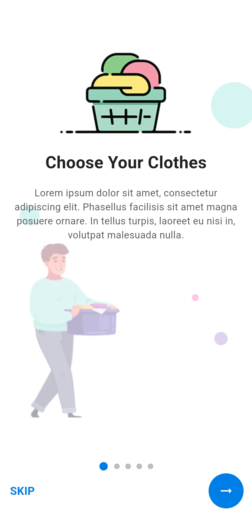</td>
    <td>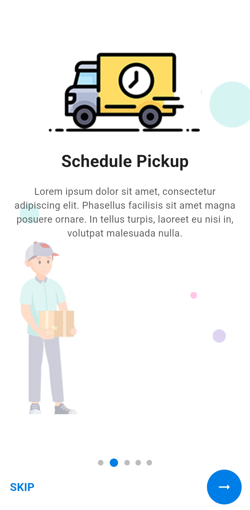</td>
    <td>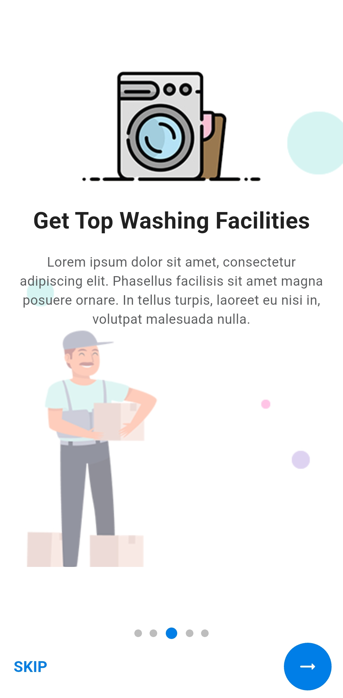</td>
    <td></td>
  </tr>
  <tr>
    <td>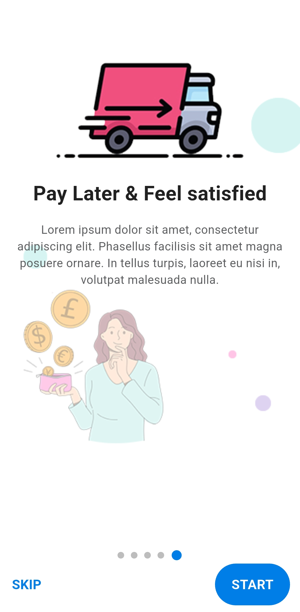</td>
    <td>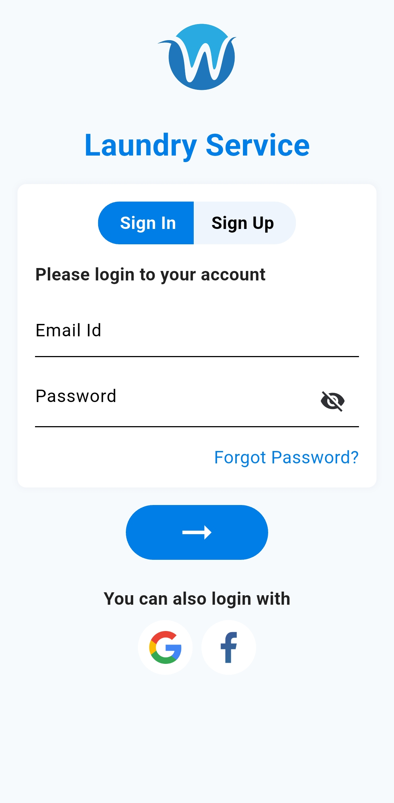</td>
    <td>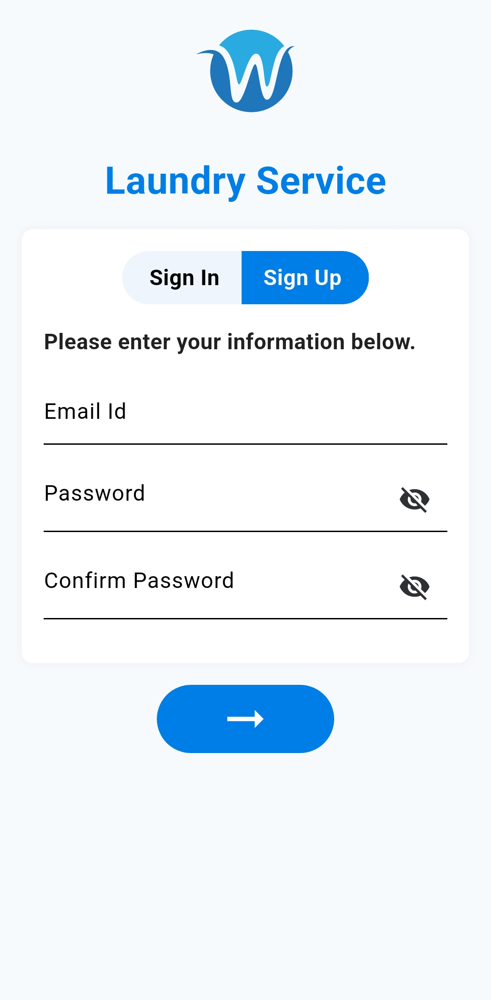</td>
    <td>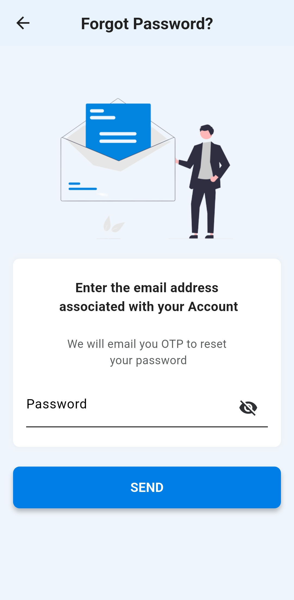</td>
  </tr>
  <tr>
    <td></td>
    <td></td>
    <td>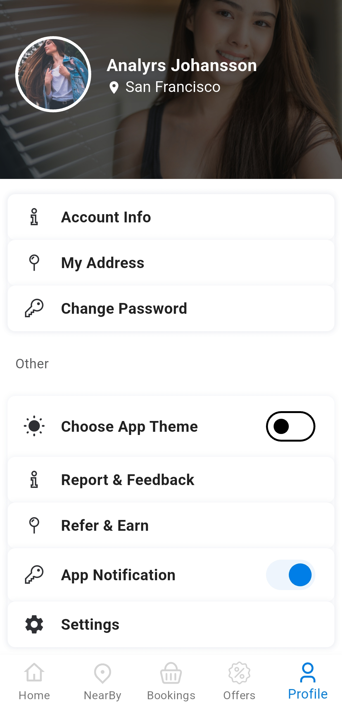</td>
    <td>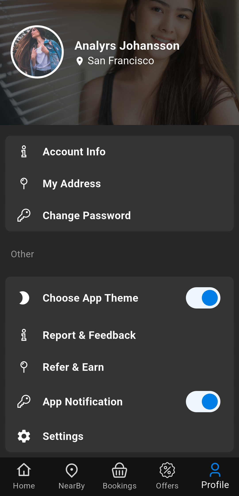</td>
  </tr>
  <tr>
    <td></td>
    <td></td>
    <td>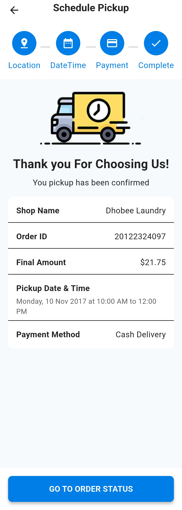</td>
    <td>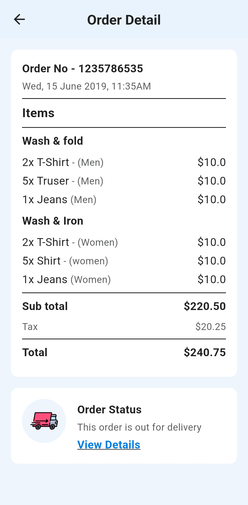</td>
  </tr>
  <tr>
    <td>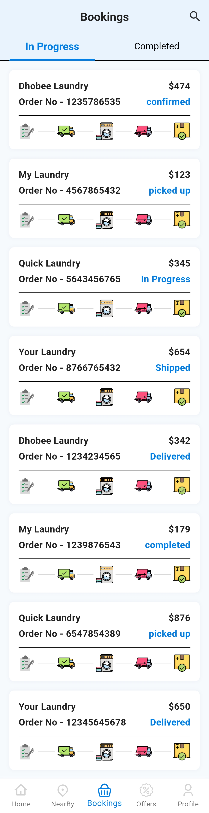</td>
    <td>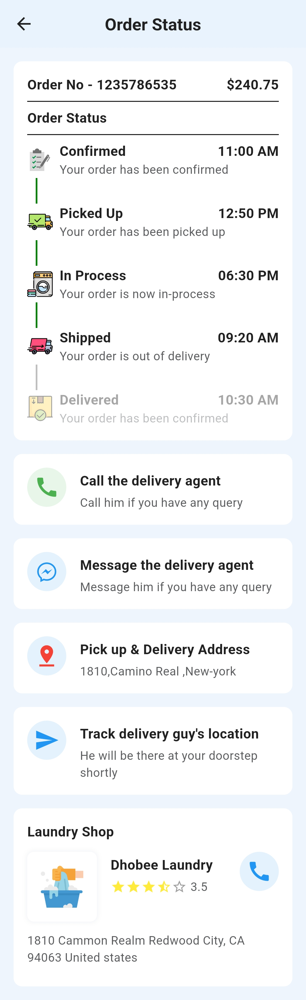</td>
    <td>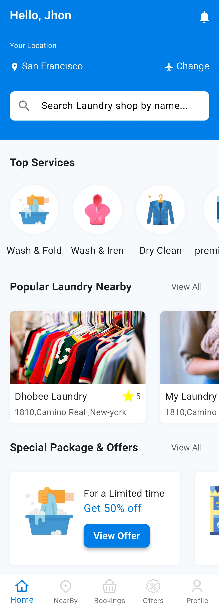</td>
    <td></td>
  </tr>
  <tr>
    <td>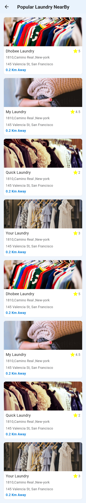</td>
    <td>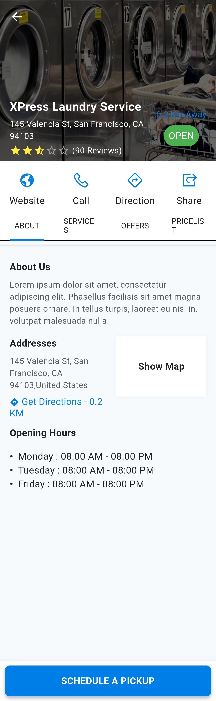</td>
    <td></td>
    <td></td>
  </tr>
</table>

---

## 📝 Notes

- Fully built with Flutter
- Modular components for fast UI prototyping
- Great base for on-demand laundry or home service apps

---

## ✍️ Created by

**Mohamed Ebrahim**
